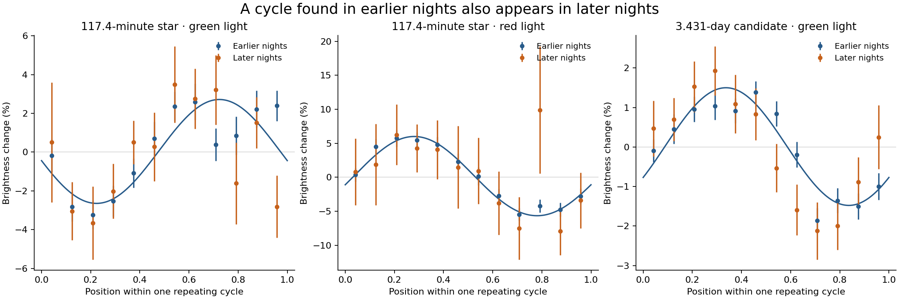

# Two white dwarfs with repeating brightness

**We found a 117.4-minute brightness cycle in SDSS J112148.80+103934.2.** It appears in ground-based ZTF measurements, five TESS observing sectors, and changes in the star's SDSS spectrum.

We also found a **3.431-day candidate cycle in WDJ215009.13+471257.26**. Image measurements put the signal at the star, but it still needs confirmation with another telescope.

Both stars were already known. What appears new is the measured cycles. Our catalogue and literature search found no earlier report of either period. The first star was already known to be magnetic and had an ATLAS “dubious variable” flag. **Neither result has independent expert review yet.** We have not established what causes the cycles.

## Reproduce it

Install **Python 3.11 or newer**, then run:

```sh
git clone https://github.com/gut-puncture/white-dwarf-variability.git
cd white-dwarf-variability
python3 reproduce.py
```

No Git? Download this repository's ZIP, unzip it, open a terminal in that folder, and run `python3 reproduce.py`. On Windows, use `py reproduce.py`.

The command installs its dependencies, downloads **123 MB** of original observations, checks every file, and recalculates the results. It does not reuse saved fits. The calculation took **about two minutes on our machine**, after setup and download. Allow **2 GB of free disk space**; speed depends on your computer and connection.

Read **`results/SUMMARY.md`** when it finishes. Plots are in `results/figures/`. Any missing input or numerical mismatch stops the run. To repeat it without replacing your first run: `python3 reproduce.py --output results-2`.

## How we got here



Dots average measurements at the same point in the cycle. Lines use earlier nights only; error bars show measurement uncertainty. Instrument and image-quality trends have been removed. The first star's green and red light vary in roughly opposite phases.

1. Selected nearby, faint, blue stars from SDSS and Gaia.
2. Used the earlier 75% of ZTF observing nights to find candidate periods.
3. Tested those periods on the later 25%, without choosing new periods.
4. Checked separate TESS observations and SDSS spectra for the 117-minute star.
5. Fitted the second star and its neighbours in the ZTF images to check which source varies.

[Exact method and limits](docs/METHOD.md) · [What was already known](docs/NOVELTY.md) · [Data sources](docs/SOURCES.md) · [File guide](docs/FILES.md)

Analysis and code were produced with OpenAI Codex under Shailesh Rana's direction. Reproducing the calculation is a check on the work; it does not replace independent scientific review.
